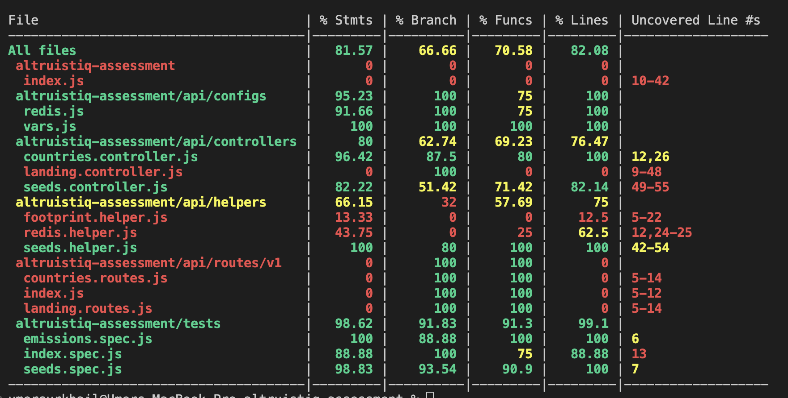

# Altruistiq hiring assessment

# Solution & Explanations

I have described my solution in detail below, please go through it and we can discuss this over call as well :) Thank you for considering me for this task!!

## About the App

This app is almost a production ready app, where the frontend gets the emissions data from the backend and displays the data in a chart on the frontend.

## Technology Stack

- ExpressJS
- Node.js
- Redis (for Cache)
- React + Vite (for Frontend)

## Requirements

For development, you will need `Node.js v20.x (recommended)`, a node global package, `NPM`, and `redis` server installed in your system.

## App Setup

You can configure this app by following the instructions mentioned below:

### Clone Repository

Run command `git clone https://github.com/Arham-ifran/altruistiq-assessment.git` to cone this public repository

### Install Packages

#### Install Backend Packages
At the root directory of the application, run the following command to install packages:

`npm install`

#### Install Frontend Packages
In a new terminal, cd into `client` directory and install packages by running the following commands:

`cd client`

`npm install`

### Prepare .env Files

- Copy the .env.example files present on root and `client` directories to their respective directories and rename them to create `.env` files for the frontend and backend. 
- Replace the required values, if any. For example `FOOT_PRINT_API_KEY`, `PORT` in case of backend

### Update `vars.js`
- In the `vars.js` update required values as per needs for example cache times and the origins to be allowed for CORS.

### Run Project Locally

#### Run Backend
At the root of the repo, run the following command to start the backend:

`npm start` 

#### Run Frontend
In another terminal, inside `client` directory, run the following command to start the frontend:

`npm run dev`

### Automated Test Cases

Test cases are written for most of the provided solution Run the following command from the root directory:

`npm test`

Run the following command to check the test coverage, which covers most of the logical files that I have written.

`npm run test:coverage`



## Documentation

### Architecture / Solution Explanation
#### Backend
- I have created the app considering it would be a production ready app.
- In production ready apps we do not directly rely on 3rd party APIs, especially when there is a rate limiter applied on the API.
- So, to implement the data emissions, we shouldn't dirctly call footprint API in our API which is displaying the data on the frontend. Otherwise users will have to wait for a very long time (in minutes) to see the results on the frontend.
- So, I have created a seed controller which fetches the data for all the countries from the footprint API and stores it in the cache.
- When a user (client) requests the data, we see if the data is available in the cache, we return it to the user. If the data is not available in the cache, we trigger a call to the seeder to fetch the data and send a message to user that the data will be ready in sometime, and do not have the api to wait for all the data to be processed.
- I am also calling the seeder method at the start of the application, so that once the application is deployed we get the data and have it stored in the redis cache. 
- Also, to prevent the data from being fetched on every deployment, I have added a time (configurable and currently 1 month in `vars.js`) in the cache, so if the data is already available it should not fetch on every restart. If the data was stored before 1 month or more, then the data is fetched again to update in the cache.
- On frontend, I have used React app with Vite
- I have created 404 page as well as loader.
- I am sorting the data on backend inside a year, and then publishing to frontend so that there are minimum processing on frontend.

### Key Points
- I have made the project structure as flexible as possible, so it can be expanded any time.
- I have restructured some of the already built components as well, for example I have moved the footprintApi.js file to inside helpers, so that it acts as a helper to fetch the data from the footprint api.
- I have created the controllers, routes, helpers, and tests in separate directories for the purpose of maintainability, scalability, and flexibility.
- I have also moved the root route from `index.js` to it's dedicated controller and routes i.e. `landing.controller.js` and `landing.routes.js`
- Most of the variables that can be used on multiple places in future, are stored in a single source, i.e `vars.js`
- I have written unit tests as well for most of the important files.
- I have also added comments to explain most of the files and their implemented workings.

### Error Handling
- The error messages returned by the API are informative.
- Handled unexpected errors using try-catch statements where needed.
- Returned the error messages where required.
- Tested error scenarios and unexpected errors.

### Additional Information
- Only the required dependencies and devDepndencies are installed in the app.

### Improvements

It is a saying `There is always room for improvements` and I strongly believe in that, I see that can be a lot of improvements that we can made into this solutions, so of them can be following which I did not included in this app because of time constraints:
- Define a proper scheduling mechanism for updating the data instead of relying on the restarts of the applications, something like cron jobs can be considered.
- Write unit tests for the missing files.
- Write CI/CD pipelines for deployment of the application.
- A few more error use cases can be handled properly

# Below is the original Readme of the test requirements

# Altruistiq hiring assessment
Welcome to Altruistiq! Thank you very much for taking the time to do this task. 🙏

### Objective
In this task you'll be creating an application consisting of an API, and a frontend consuming that API and rendering a chart.<br/><br/>
The goal is not the create the most complete app, but to understand how you solve problems and how you code. Upon delivering the app, we will discuss your solutions, decisions and thought process. 

We suggest to not spent more than 2 hours, but you're free to spend more time. And don't worry if it takes you longer.
Also it's fine to descope parts of the task, that's really up to you.

### Get Started
This repo will help you to kick-start your application. A backend has been setup for you, but for the frontend you're free to use anything you like. For Vue we suggest Vite, for React Create-React-App. It's also totally fine to use Next/Nuxt for the whole project and copy over the provided code. Whatever stack works for you!

### Install
Clone this repo, then
```bash
npm i
```

in `.env` copy over the secret that you've received from us.

### Run
Code automatically reloads upon code changes. 
The backend runs on port 5000, go to `http://localhost:5000/` to 

```bash
npm start
```

### Run tests
To run test the backend needs to be running (code and tests are being watched so automatically reruns).
```
npm test
```

# Tasks
Please read through all the tasks to understand the full scope of this assessment.

## Task 1 - Create an API that returns the total emission per country per year
To get the data for this API, you will use the [footprint api](https://data.footprintnetwork.org/#/api) which has already
been setup for you. Use as follows:

```js
import footprintApi from './footprintApi'

// get all countries and their countryCodes
await footprintApi.getCountries()

// this will give you carbon data per year for that country
await footprintApi.getDataForCountry(countryCode)

```

The emissions number is represented in the country json as `carbon`, this is the number you're looking for.

Note: there are (unknown) rate limits on the footprint API which you will need to work around.

## Task 2 - Write test(s)
Write test(s) to make sure your API works as expected.

## Task 3 - Create an animated chart
Create a chart as per this example, but style it as per the Figma design. The chart iterates through the available years, and shows for each year a list of countries sorted by the emission for that year. Note that some countries do not have data for a specific year.<br/><br/>


Fetch [this Figma file](https://www.figma.com/file/WJ1BvQzvFchIFxo67iIywi/Altruistiq-frontend-hiring-task) to get started.

The font used is
```
@import url('https://fonts.googleapis.com/css2?family=Inter:wght@300;400;500;600&display=swap')
```

Requirements:
- use Vue or React, and Sass
- use either components, native DOM or D3 to create the chart.
- do not use chart / css / component / animation / caching libraries. The idea is that you show your skills by coding this manually.
- chart should be responsive, test by changing the window size (dragging)
- calculate and show world total footprint on the page

# Deliver your result
Please provide a git repository with your code and send us the url.